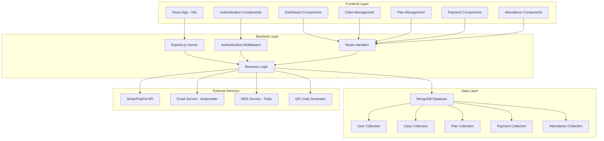

# Design Document

## Overview

The Gym Management System design builds upon the existing MERN stack foundation to create a comprehensive fitness center management platform. The system leverages the current backend API structure while enhancing the frontend user experience and adding missing features like QR code attendance, automated notifications, and improved mobile responsiveness.

## Architecture

### System Architecture



### Technology Stack

**Frontend:**
- React 19.1.1 with Vite
- React Router DOM for navigation
- Axios for API communication
- React Toastify for notifications
- React QR Code for QR generation
- QR Scanner for QR reading
- JWT Decode for token handling

**Backend:**
- Node.js with Express.js
- MongoDB with Mongoose ODM
- JWT for authentication
- bcryptjs for password hashing
- Multer for file uploads
- Helmet for security
- CORS for cross-origin requests
- Rate limiting for API protection

**External Integrations:**
- Stripe for payment processing
- Nodemailer for email notifications
- Twilio for SMS notifications
- QR Code library for attendance tracking

## Components and Interfaces

### Frontend Component Structure

```
src/
├── components/
│   ├── Auth/
│   │   ├── Login.jsx
│   │   ├── Register.jsx
│   │   └── ProtectedRoute.jsx
│   ├── Dashboard/
│   │   ├── AdminDashboard.jsx
│   │   ├── TrainerDashboard.jsx
│   │   └── MemberDashboard.jsx
│   ├── Classes/
│   │   ├── ClassList.jsx
│   │   ├── ClassCard.jsx
│   │   ├── ClassBooking.jsx
│   │   └── ClassManagement.jsx
│   ├── Plans/
│   │   ├── PlanList.jsx
│   │   ├── PlanCard.jsx
│   │   ├── WorkoutPlanCreator.jsx
│   │   └── DietPlanCreator.jsx
│   ├── Payments/
│   │   ├── PaymentForm.jsx
│   │   ├── PaymentHistory.jsx
│   │   └── SubscriptionManager.jsx
│   ├── Attendance/
│   │   ├── QRScanner.jsx
│   │   ├── QRGenerator.jsx
│   │   ├── AttendanceTracker.jsx
│   │   └── AttendanceReports.jsx
│   ├── Notifications/
│   │   ├── NotificationCenter.jsx
│   │   ├── NotificationSettings.jsx
│   │   └── NotificationToast.jsx
│   └── Common/
│       ├── Header.jsx
│       ├── Sidebar.jsx
│       ├── LoadingSpinner.jsx
│       └── ErrorBoundary.jsx
├── services/
│   ├── api.js
│   ├── auth.js
│   ├── classes.js
│   ├── plans.js
│   ├── payments.js
│   └── notifications.js
└── utils/
    ├── constants.js
    ├── helpers.js
    └── validators.js
```

### Backend API Structure

```
routes/
├── auth.js          # Authentication endpoints
├── users.js         # User management
├── classes.js       # Class management
├── plans.js         # Membership and workout plans
├── payments.js      # Payment processing
├── attendance.js    # Attendance tracking
└── notifications.js # Notification management

middleware/
├── auth.js          # JWT authentication
├── validation.js    # Input validation
├── upload.js        # File upload handling
└── errorHandler.js  # Error handling
```

### API Endpoints Design

**Authentication Endpoints:**
- `POST /api/auth/register` - User registration
- `POST /api/auth/login` - User login
- `POST /api/auth/logout` - User logout
- `POST /api/auth/forgot-password` - Password reset request
- `POST /api/auth/reset-password` - Password reset confirmation

**Admin Management Endpoints:**
- `GET /api/admin/stats` - Dashboard statistics
- `GET /api/admin/members` - List all members
- `POST /api/admin/members` - Add new member
- `DELETE /api/admin/members/:id` - Remove member
- `GET /api/admin/trainers` - List all trainers
- `POST /api/admin/trainers` - Add new trainer
- `DELETE /api/admin/trainers/:id` - Remove trainer

**Class Management Endpoints:**
- `GET /api/classes` - List available classes
- `POST /api/classes` - Create new class
- `PUT /api/classes/:id` - Update class
- `DELETE /api/classes/:id` - Delete class
- `POST /api/classes/:id/enroll` - Enroll in class
- `DELETE /api/classes/:id/cancel` - Cancel enrollment

**Plan Management Endpoints:**
- `GET /api/plans` - List membership plans
- `GET /api/plans/workout/:trainerId` - Trainer's workout plans
- `POST /api/plans/workout` - Create workout plan
- `PUT /api/plans/workout/:id` - Update workout plan
- `DELETE /api/plans/workout/:id` - Delete workout plan

**Attendance Endpoints:**
- `POST /api/attendance/checkin` - Manual check-in
- `POST /api/attendance/qr-checkin` - QR code check-in
- `GET /api/attendance/generate-qr/:classId` - Generate QR for class
- `GET /api/attendance/reports` - Attendance reports

**Notification Endpoints:**
- `GET /api/notifications` - Get user notifications
- `POST /api/notifications/send` - Send notification
- `PUT /api/notifications/:id/read` - Mark as read
- `PUT /api/notifications/settings` - Update notification preferences

## Data Models

### Enhanced User Model
```javascript
{
  // Basic Information
  firstName: String,
  lastName: String,
  email: String,
  password: String,
  phone: String,
  role: ['admin', 'trainer', 'member'],
  profileImage: String,
  
  // Personal Details
  dateOfBirth: Date,
  gender: ['male', 'female', 'other'],
  address: {
    street: String,
    city: String,
    state: String,
    zipCode: String,
    country: String
  },
  
  // Member-specific
  membershipType: ['basic', 'premium', 'vip'],
  membershipStartDate: Date,
  membershipEndDate: Date,
  assignedTrainer: ObjectId,
  
  // Trainer-specific
  specializations: [String],
  experience: Number,
  certifications: [Object],
  
  // Health Information
  healthInfo: {
    height: Number,
    weight: Number,
    fitnessGoals: [String],
    medicalConditions: [String]
  },
  
  // Notification Preferences
  notificationPreferences: {
    email: Boolean,
    sms: Boolean,
    push: Boolean,
    paymentReminders: Boolean,
    classUpdates: Boolean,
    planUpdates: Boolean
  },
  
  // System Fields
  isActive: Boolean,
  lastLogin: Date,
  createdAt: Date,
  updatedAt: Date
}
```

### Enhanced Attendance Model
```javascript
{
  member: ObjectId,
  class: ObjectId,
  checkInTime: Date,
  checkOutTime: Date,
  attendanceType: ['manual', 'qr_code', 'auto'],
  location: {
    latitude: Number,
    longitude: Number
  },
  qrCodeUsed: String,
  markedBy: ObjectId, // For manual attendance
  notes: String,
  createdAt: Date
}
```

### Notification Model
```javascript
{
  recipient: ObjectId,
  sender: ObjectId,
  type: ['payment_reminder', 'class_update', 'plan_assignment', 'general'],
  title: String,
  message: String,
  channels: ['email', 'sms', 'push'],
  status: ['pending', 'sent', 'delivered', 'failed'],
  scheduledFor: Date,
  sentAt: Date,
  readAt: Date,
  metadata: Object,
  createdAt: Date
}
```

### QR Code Session Model
```javascript
{
  class: ObjectId,
  qrCode: String,
  generatedBy: ObjectId,
  expiresAt: Date,
  isActive: Boolean,
  usageCount: Number,
  maxUsage: Number,
  createdAt: Date
}
```

## Error Handling

### Frontend Error Handling Strategy

**Error Boundary Implementation:**
```javascript
class ErrorBoundary extends React.Component {
  constructor(props) {
    super(props);
    this.state = { hasError: false, error: null };
  }

  static getDerivedStateFromError(error) {
    return { hasError: true, error };
  }

  componentDidCatch(error, errorInfo) {
    console.error('Error caught by boundary:', error, errorInfo);
    // Log to error reporting service
  }

  render() {
    if (this.state.hasError) {
      return <ErrorFallback error={this.state.error} />;
    }
    return this.props.children;
  }
}
```

**API Error Handling:**
```javascript
// Axios interceptor for global error handling
axios.interceptors.response.use(
  (response) => response,
  (error) => {
    if (error.response?.status === 401) {
      // Handle authentication errors
      localStorage.removeItem('token');
      window.location.href = '/login';
    } else if (error.response?.status >= 500) {
      // Handle server errors
      toast.error('Server error. Please try again later.');
    }
    return Promise.reject(error);
  }
);
```

### Backend Error Handling

**Global Error Handler Middleware:**
```javascript
const errorHandler = (err, req, res, next) => {
  let error = { ...err };
  error.message = err.message;

  // Log error
  console.error(err);

  // Mongoose bad ObjectId
  if (err.name === 'CastError') {
    const message = 'Resource not found';
    error = { message, statusCode: 404 };
  }

  // Mongoose duplicate key
  if (err.code === 11000) {
    const message = 'Duplicate field value entered';
    error = { message, statusCode: 400 };
  }

  // Mongoose validation error
  if (err.name === 'ValidationError') {
    const message = Object.values(err.errors).map(val => val.message);
    error = { message, statusCode: 400 };
  }

  res.status(error.statusCode || 500).json({
    success: false,
    error: error.message || 'Server Error'
  });
};
```

## Testing Strategy

### Frontend Testing

**Unit Testing with Jest and React Testing Library:**
```javascript
// Component testing example
describe('ClassCard Component', () => {
  test('renders class information correctly', () => {
    const mockClass = {
      name: 'Yoga Class',
      trainer: { firstName: 'John', lastName: 'Doe' },
      schedule: { startTime: '09:00', endTime: '10:00' },
      capacity: 20,
      currentEnrollment: 15
    };

    render(<ClassCard classData={mockClass} />);
    
    expect(screen.getByText('Yoga Class')).toBeInTheDocument();
    expect(screen.getByText('John Doe')).toBeInTheDocument();
    expect(screen.getByText('5 spots left')).toBeInTheDocument();
  });
});
```

**Integration Testing:**
```javascript
// API integration testing
describe('Class Booking Integration', () => {
  test('successfully books a class', async () => {
    const user = userEvent.setup();
    render(<ClassBooking classId="123" />);
    
    const bookButton = screen.getByRole('button', { name: /book class/i });
    await user.click(bookButton);
    
    await waitFor(() => {
      expect(screen.getByText('Successfully booked!')).toBeInTheDocument();
    });
  });
});
```

### Backend Testing

**API Endpoint Testing with Jest and Supertest:**
```javascript
describe('Authentication Endpoints', () => {
  test('POST /api/auth/login - successful login', async () => {
    const userData = {
      email: 'test@example.com',
      password: 'password123'
    };

    const response = await request(app)
      .post('/api/auth/login')
      .send(userData)
      .expect(200);

    expect(response.body.success).toBe(true);
    expect(response.body.token).toBeDefined();
  });

  test('POST /api/auth/login - invalid credentials', async () => {
    const userData = {
      email: 'test@example.com',
      password: 'wrongpassword'
    };

    const response = await request(app)
      .post('/api/auth/login')
      .send(userData)
      .expect(401);

    expect(response.body.success).toBe(false);
    expect(response.body.message).toBe('Invalid credentials');
  });
});
```

### QR Code Attendance Testing

**QR Code Generation and Validation:**
```javascript
describe('QR Code Attendance', () => {
  test('generates valid QR code for class', async () => {
    const classId = new mongoose.Types.ObjectId();
    const qrData = await generateClassQR(classId);
    
    expect(qrData.qrCode).toBeDefined();
    expect(qrData.expiresAt).toBeInstanceOf(Date);
    expect(qrData.class.toString()).toBe(classId.toString());
  });

  test('validates QR code for attendance', async () => {
    const qrCode = 'valid-qr-code-string';
    const memberId = new mongoose.Types.ObjectId();
    
    const result = await validateQRAttendance(qrCode, memberId);
    
    expect(result.success).toBe(true);
    expect(result.attendance).toBeDefined();
  });
});
```

### Performance Testing

**Load Testing Strategy:**
- Use tools like Artillery or k6 for API load testing
- Test concurrent user scenarios (100+ simultaneous bookings)
- Monitor database performance under load
- Test file upload performance for profile images and plans

**Frontend Performance:**
- Implement React.memo for expensive components
- Use lazy loading for route components
- Optimize bundle size with code splitting
- Implement virtual scrolling for large lists

## Security Considerations

### Authentication and Authorization

**JWT Token Management:**
- Short-lived access tokens (15 minutes)
- Refresh token rotation
- Secure token storage (httpOnly cookies for web)
- Token blacklisting for logout

**Role-Based Access Control:**
```javascript
const authorize = (...roles) => {
  return (req, res, next) => {
    if (!req.user) {
      return res.status(401).json({ message: 'Not authenticated' });
    }
    
    if (!roles.includes(req.user.role)) {
      return res.status(403).json({ message: 'Not authorized' });
    }
    
    next();
  };
};
```

### Data Protection

**Input Validation and Sanitization:**
```javascript
const { body, validationResult } = require('express-validator');

const validateUserRegistration = [
  body('email').isEmail().normalizeEmail(),
  body('password').isLength({ min: 8 }).matches(/^(?=.*[a-z])(?=.*[A-Z])(?=.*\d)/),
  body('firstName').trim().isLength({ min: 1, max: 50 }),
  body('lastName').trim().isLength({ min: 1, max: 50 }),
  (req, res, next) => {
    const errors = validationResult(req);
    if (!errors.isEmpty()) {
      return res.status(400).json({ errors: errors.array() });
    }
    next();
  }
];
```

**File Upload Security:**
```javascript
const multer = require('multer');
const path = require('path');

const storage = multer.diskStorage({
  destination: './uploads/',
  filename: (req, file, cb) => {
    cb(null, `${Date.now()}-${Math.round(Math.random() * 1E9)}${path.extname(file.originalname)}`);
  }
});

const upload = multer({
  storage,
  limits: { fileSize: 5 * 1024 * 1024 }, // 5MB limit
  fileFilter: (req, file, cb) => {
    const allowedTypes = /jpeg|jpg|png|pdf/;
    const extname = allowedTypes.test(path.extname(file.originalname).toLowerCase());
    const mimetype = allowedTypes.test(file.mimetype);
    
    if (mimetype && extname) {
      return cb(null, true);
    } else {
      cb(new Error('Invalid file type'));
    }
  }
});
```

### API Security

**Rate Limiting:**
```javascript
const rateLimit = require('express-rate-limit');

const authLimiter = rateLimit({
  windowMs: 15 * 60 * 1000, // 15 minutes
  max: 5, // 5 attempts per window
  message: 'Too many login attempts, please try again later',
  standardHeaders: true,
  legacyHeaders: false,
});

app.use('/api/auth/login', authLimiter);
```

**CORS Configuration:**
```javascript
const corsOptions = {
  origin: process.env.NODE_ENV === 'production' 
    ? ['https://yourdomain.com'] 
    : ['http://localhost:3000', 'http://localhost:5173'],
  credentials: true,
  optionsSuccessStatus: 200
};
```

## Mobile Responsiveness

### Responsive Design Strategy

**Breakpoint System:**
```css
/* Mobile First Approach */
.container {
  padding: 1rem;
}

/* Tablet */
@media (min-width: 768px) {
  .container {
    padding: 2rem;
    max-width: 1200px;
    margin: 0 auto;
  }
}

/* Desktop */
@media (min-width: 1024px) {
  .container {
    padding: 3rem;
  }
}
```

**Touch-Friendly Interface:**
- Minimum touch target size of 44px
- Swipe gestures for navigation
- Pull-to-refresh functionality
- Optimized form inputs for mobile keyboards

**Progressive Web App Features:**
```javascript
// Service Worker for offline functionality
self.addEventListener('fetch', (event) => {
  if (event.request.url.includes('/api/')) {
    event.respondWith(
      caches.match(event.request)
        .then((response) => {
          return response || fetch(event.request);
        })
    );
  }
});
```

## Performance Optimization

### Frontend Optimization

**Code Splitting:**
```javascript
import { lazy, Suspense } from 'react';

const AdminDashboard = lazy(() => import('./components/Dashboard/AdminDashboard'));
const TrainerDashboard = lazy(() => import('./components/Dashboard/TrainerDashboard'));

function App() {
  return (
    <Suspense fallback={<LoadingSpinner />}>
      <Routes>
        <Route path="/admin" element={<AdminDashboard />} />
        <Route path="/trainer" element={<TrainerDashboard />} />
      </Routes>
    </Suspense>
  );
}
```

**Image Optimization:**
```javascript
const ImageWithFallback = ({ src, alt, className }) => {
  const [imgSrc, setImgSrc] = useState(src);
  
  return (
     setImgSrc('/default-avatar.png')}
      loading="lazy"
    />
  );
};
```

### Backend Optimization

**Database Indexing:**
```javascript
// User model indexes
userSchema.index({ email: 1 });
userSchema.index({ role: 1, isActive: 1 });

// Class model indexes
classSchema.index({ trainer: 1, 'schedule.dayOfWeek': 1 });
classSchema.index({ type: 1, isActive: 1 });

// Attendance model indexes
attendanceSchema.index({ member: 1, createdAt: -1 });
attendanceSchema.index({ class: 1, checkInTime: 1 });
```

**Caching Strategy:**
```javascript
const redis = require('redis');
const client = redis.createClient();

const cacheMiddleware = (duration = 300) => {
  return async (req, res, next) => {
    const key = req.originalUrl;
    const cached = await client.get(key);
    
    if (cached) {
      return res.json(JSON.parse(cached));
    }
    
    res.sendResponse = res.json;
    res.json = (body) => {
      client.setex(key, duration, JSON.stringify(body));
      res.sendResponse(body);
    };
    
    next();
  };
};
```